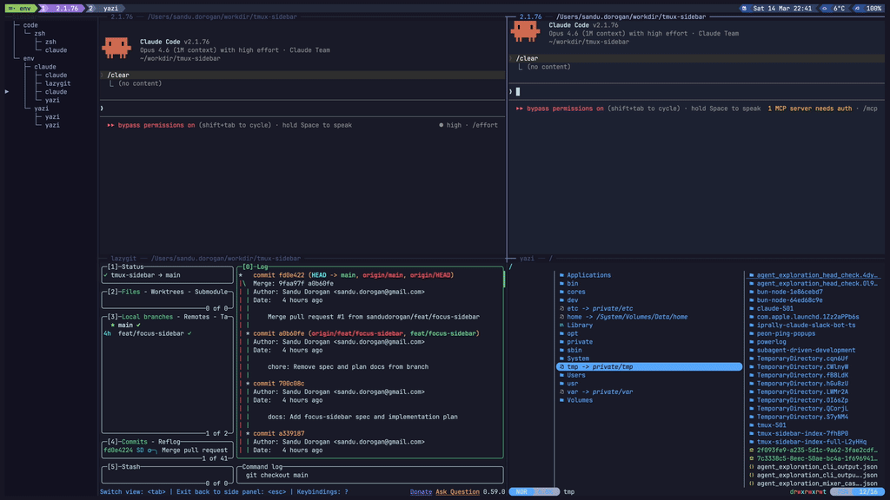

# tmux-sidebar

[](https://github.com/sandudorogan/tmux-sidebar/actions/workflows/test.yml)

A tmux plugin that keeps a persistent, interactive session tree on the left
side of every window, with live badges for `claude`, `codex`, `cursor`, and `opencode`.

```
  ┌─ Sidebar ────────────┬────────────────────────────────┐
  │                      │                                │
  │   ├─ work            │  $ claude                      │
  │   │  └─ zsh          │                                │
  │   │     ├─ claude    │  Working on your request...    │
  │   │     └─ zsh       │                                │
  │   └─ env             │                                │
  │      ├─ claude       │                                │
  │      │  ├─ claude    │                                │
  │      │  ├─ lazygit   │                                │
  │ ▶    │  ├─ claude ⏳│                                │
  │      │  └─ yazi      │                                │
  │      └─ yazi         │                                │
  │         ├─ yazi      │                                │
  │         └─ yazi      │                                │
  │                      │                                │
  └──────────────────────┴────────────────────────────────┘
```



## Features

**Interactive tree** — browse sessions, windows, and panes as a Unicode tree.
Press `Enter` to jump to the selected pane.

**Pane icons and agent badges** — per-pane app icons and live status updates in real time:

| Badge | Status      | Meaning                        |
| :---: | ----------- | ------------------------------ |
| `⏳`  | running     | Agent is working               |
| `❓`  | needs-input | Waiting for permission / input |
| `✅`  | done        | Finished                       |
| `❌`  | error       | Something went wrong           |

`done` and `needs-input` clear when you focus the pane.

**Auto-mirroring** — open the sidebar once and it follows you across windows.

**Session management** — add windows and sessions, rename them, and close panes
without leaving the sidebar.

## Install

### With TPM

```tmux
set -g @plugin 'sandudorogan/tmux-sidebar'
set -g @tmux_sidebar_install_agent_hooks 1   # optional
```

Reload tmux and press `prefix + I`.

### Manual

```bash
git clone https://github.com/sandudorogan/tmux-sidebar \
  ~/.tmux/plugins/tmux-sidebar
```

Source it in your tmux config:

```tmux
source-file ~/.tmux/plugins/tmux-sidebar/sidebar.tmux
```

Then `tmux source-file ~/.tmux.conf`.

To patch Claude Code, Codex, Cursor, and OpenCode hook config after a manual install:

```bash
bash ~/.tmux/plugins/tmux-sidebar/scripts/features/hooks/install-agent-hooks.sh
```

## Usage

### Toggle

`<prefix> t` opens or closes the sidebar.

### Focus

`<prefix> T` switches focus between the sidebar and your main pane:

- **In sidebar** — returns to the previous main pane
- **Sidebar open** — moves focus into the sidebar
- **Sidebar closed** — opens the sidebar and focuses it

### Navigation (inside the sidebar)

| Key          | Action                           |
| ------------ | -------------------------------- |
| `j` / `Down` | Move selection down              |
| `k` / `Up`   | Move selection up                |
| `gg`         | Jump to the top of the list      |
| `G`          | Jump to the bottom of the list   |
| `Ctrl+o`     | Jump backward in the jump list   |
| `Ctrl+i`     | Jump forward in the jump list    |
| `Enter`      | Jump to the selected pane        |
| `aw`         | Add a window (prompts for name)  |
| `as`         | Add a session (prompts for name) |
| `rw`         | Rename the selected window       |
| `rs`         | Rename the selected session      |
| `f`          | Toggle pane filter mode          |
| `x`          | Close the selected pane          |
| `p`          | Toggle hide-panes mode           |
| `q`          | Close the sidebar                |
| `Ctrl+l`     | Return focus to the main pane    |

New windows and sessions are inserted relative to the selected row. Closing the
last pane removes its window; removing the last window removes the session.

The jump list starts from the pane you used to enter the sidebar. `gg` and `G`
add sidebar-row targets, `Ctrl+o` moves backward, and `Ctrl+i` moves forward.
The final backward jump returns focus to the original tmux pane. The list is
cleared when the sidebar loses focus.

## Configuration

Set options with `set -g` in your tmux config.

### Sidebar width

```tmux
set -g @tmux_sidebar_width 30      # default: 25
```

### Focus on open

By default, toggling the sidebar focuses it. Disable that behavior to keep
focus in the main pane:

```tmux
set -g @tmux_sidebar_focus_on_open 0   # default: 1
```

### Session order

Control session order in the tree:

```tmux
set -g @tmux_sidebar_session_order "work,ops,scratch"
```

Sessions not listed appear afterward in their default order. Adding or renaming
sessions from the sidebar updates this list automatically.

### Pane filter

Show only panes matching a comma-separated list of process or agent tokens:

```tmux
set -g @tmux_sidebar_filter "opencode,codex,claude,cursor"
```

Matching is case-insensitive and checks pane command, pane title, and stored
agent metadata.

Press `f` in the sidebar to toggle filtering without changing the list. Runtime
state is stored in `@tmux_sidebar_filter_enabled` and defaults to on.

### Custom shortcuts

Override the default sidebar shortcuts:

```tmux
set -g @tmux_sidebar_add_window_shortcut  zw   # default: aw
set -g @tmux_sidebar_add_session_shortcut zs   # default: as
set -g @tmux_sidebar_go_top_shortcut      tt   # default: gg
set -g @tmux_sidebar_go_bottom_shortcut   B    # default: G
set -g @tmux_sidebar_jump_back_shortcut   C-p  # default: C-o
set -g @tmux_sidebar_jump_forward_shortcut C-n # default: C-i
set -g @tmux_sidebar_rename_window_shortcut rw # default: rw
set -g @tmux_sidebar_rename_session_shortcut rs # default: rs
set -g @tmux_sidebar_toggle_filter_shortcut ff # default: f
set -g @tmux_sidebar_close_pane_shortcut  dd   # default: x
```

Control-key shortcuts use `C-x` notation.

If any shortcut is empty, duplicated, a prefix of another shortcut, or contains
the reserved `q` key, all ten revert to defaults.

### Scroll offset

Control how much context stays visible above and below the cursor:

```tmux
set -g @tmux_sidebar_scrolloff 8      # default: 8
```

Set `0` for edge-only scrolling.

### Hide panes

Show only sessions and windows. Panes with an active agent badge still appear.

```tmux
set -g @tmux_sidebar_hide_panes on     # default: off
```

### Badge icons

Badges follow the active icon theme. The default `ascii` and `unicode` paths
use `⏳`, `❓`, `✅`, and `❌`. When the active icon theme resolves to
`nerdfont`, badges switch to `nf-fa-hourglass_2`, `nf-fa-circle_question`,
`nf-fa-circle_check`, and `nf-oct-stop`.

You can still override any status badge explicitly:

```tmux
set -g @tmux_sidebar_badge_running      "⏳"
set -g @tmux_sidebar_badge_needs_input  "❓"
set -g @tmux_sidebar_badge_done         "✅"
set -g @tmux_sidebar_badge_error        "❌"
```

### Pane icons

Pane icons default to `auto`, which checks whether the tmux host has a Nerd
Font installed in a standard font directory. If it finds one, the sidebar uses
the Nerd Font icon theme. Otherwise it falls back to the ASCII-safe theme so it
still renders cleanly on most systems and fits in the sidebar's narrow default
width.

```tmux
set -g @tmux_sidebar_icon_theme "auto"    # default: auto
set -g @tmux_sidebar_icon_theme "ascii"   # force ASCII-safe icons
set -g @tmux_sidebar_icon_theme "unicode" # optional richer built-in theme
set -g @tmux_sidebar_icon_theme "nerdfont" # force Nerd Font glyphs
```

Known panes such as shells, coding agents, `node`, `lazygit`, `yazi`,
`ranger`, `bb`, `clojure`, `java`, `vim`, `ssh`, pagers, and tmux get
built-in icons. Unknown commands fall back to a placeholder icon.

The built-in Nerd Font theme uses glyphs such as `nf-md-face_agent` for coding
agents, `nf-md-code_greater_than` for shells, `nf-dev-less` for `less`,
`nf-md-cat` for `cat`, `nf-md-dock_top` for `top`-style monitors, and
`nf-md-git` for `lazygit`.

You can override any individual app icon:

```tmux
set -g @tmux_sidebar_icon_claude "A"
set -g @tmux_sidebar_icon_shell  ">"
set -g @tmux_sidebar_icon_unknown "?"
```

Available override keys match the canonical app ids:
`claude`, `codex`, `opencode`, `cursor`, `shell`, `node`, `python`, `git`,
`lazygit`, `yazi`, `ranger`, `bb`, `cat`, `clojure`, `java`, `less`, `vim`,
`ssh`, `pager`, `top`, `tmux`, and `unknown`.

Installed Nerd Fonts are only a hint. If your terminal is not actually using a
Nerd Font, the Nerd Font glyphs will not render correctly. In that case, either
switch your terminal font to a Nerd Font or set `@tmux_sidebar_icon_theme` to
`ascii` or `unicode` explicitly.

If auto-detection picks the wrong theme, set `@tmux_sidebar_icon_theme`
explicitly. Remote tmux sessions are especially likely to need an explicit
setting because `auto` checks fonts installed on the tmux host, not the font
configured by the terminal client displaying that session.

### Colors

Override tree colors:

```tmux
set -g @tmux_sidebar_color_session "#1a2f4e"
set -g @tmux_sidebar_color_window  "#4a5568"
set -g @tmux_sidebar_color_pane    "#a0aec0"
```

Values are hex colors. When unset, tmux-sidebar derives them from your tmux
theme.

### Key overrides

Override the tmux keybindings used to toggle and focus the sidebar:

```tmux
set -g @tmux_sidebar_toggle_key  b    # default: t
set -g @tmux_sidebar_focus_key   B    # default: T
```

### Agent hook install

Enable automatic hook setup when the plugin loads:

```tmux
set -g @tmux_sidebar_install_agent_hooks 1   # default: 0
```

### Quick reference

| Option                                | Default | Description                      |
| ------------------------------------- | :-----: | -------------------------------- |
| `@tmux_sidebar_width`                 |  `25`   | Sidebar column width             |
| `@tmux_sidebar_focus_on_open`         |   `1`   | Focus sidebar when toggled open  |
| `@tmux_sidebar_session_order`         |    —    | Comma-separated session ordering |
| `@tmux_sidebar_filter`                |    —    | Comma-separated pane filter      |
| `@tmux_sidebar_add_window_shortcut`   |  `aw`   | Shortcut to add a window         |
| `@tmux_sidebar_add_session_shortcut`  |  `as`   | Shortcut to add a session        |
| `@tmux_sidebar_go_top_shortcut`       |  `gg`   | Shortcut to jump to the top      |
| `@tmux_sidebar_go_bottom_shortcut`    |   `G`   | Shortcut to jump to the bottom   |
| `@tmux_sidebar_jump_back_shortcut`    |  `C-o`  | Shortcut to jump backward        |
| `@tmux_sidebar_jump_forward_shortcut` |  `C-i`  | Shortcut to jump forward         |
| `@tmux_sidebar_rename_window_shortcut` | `rw`   | Shortcut to rename a window      |
| `@tmux_sidebar_rename_session_shortcut` | `rs`  | Shortcut to rename a session     |
| `@tmux_sidebar_toggle_filter_shortcut` | `f`    | Shortcut to toggle filter mode   |
| `@tmux_sidebar_close_pane_shortcut`   |   `x`   | Shortcut to close selected pane  |
| `@tmux_sidebar_hide_panes`            |  `off`  | Show only sessions and windows   |
| `@tmux_sidebar_scrolloff`             |   `8`   | Cursor scroll margin             |
| `@tmux_sidebar_badge_running`         |  `⏳`   | Badge for running status         |
| `@tmux_sidebar_badge_needs_input`     |  `❓`   | Badge for needs-input status     |
| `@tmux_sidebar_badge_done`            |  `✅`   | Badge for done status            |
| `@tmux_sidebar_badge_error`           |  `❌`   | Badge for error status           |
| `@tmux_sidebar_icon_theme`            | `auto`  | Pane icon theme / auto-detect    |
| `@tmux_sidebar_color_session`         |    —    | Session name color (hex)         |
| `@tmux_sidebar_color_window`          |    —    | Window name color (hex)          |
| `@tmux_sidebar_color_pane`            |    —    | Pane name color (hex)            |
| `@tmux_sidebar_toggle_key`            |   `t`   | Tmux key to toggle sidebar       |
| `@tmux_sidebar_focus_key`             |   `T`   | Tmux key to focus sidebar        |
| `@tmux_sidebar_install_agent_hooks`   |   `0`   | Install Claude/Codex/Cursor/OpenCode hooks on load |

| Environment variable     | Description                                                                                    |
| ------------------------ | ---------------------------------------------------------------------------------------------- |
| `TMUX_SIDEBAR_STATE_DIR` | State file directory (default `$XDG_STATE_HOME/tmux-sidebar` or `~/.local/state/tmux-sidebar`) |

## Hook Integration

Agent badges are written through
`scripts/features/state/update-pane-state.sh`.

Custom integrations should report the current pane, usually via
`--pane "$TMUX_PANE"`.

### Quick setup

Choose one setup path:

- TPM: set `@tmux_sidebar_install_agent_hooks 1` before installing or reloading
  the plugin.
- Manual install: run
  `bash ~/.tmux/plugins/tmux-sidebar/scripts/features/hooks/install-agent-hooks.sh`

The installer updates:

- `~/.claude/settings.json`
- `~/.codex/config.toml`
- `~/.cursor/hooks.json`
- `~/.config/opencode/plugins/tmux-sidebar.js`

It also creates timestamped backups before changing existing files.

### Manual wiring

If you prefer to edit configs yourself, point each tool at the installed hook
wrappers under `scripts/features/hooks/`:

- Claude Code: `hook-claude.sh`
- Codex: `hook-codex.sh`
- Cursor: `hook-cursor.sh`
- OpenCode: `hook-opencode.sh`

Ready-to-copy examples live in `examples/`.

Cursor uses native hooks in `~/.cursor/hooks.json`. The sidebar binds Cursor
events to panes by preferring `TMUX_PANE` when Cursor was launched from that
tmux pane, then falling back to the first `workspace_roots` entry that matches
a tmux pane working directory. Cursor does not emit Claude-style permission
events, so the `needs-input` badge is inferred from `postToolUseFailure` events
with `failure_type=permission_denied`.

## Requirements

- tmux 3.0+
- Python 3
- bash 4.0+

## Development

### Internal layout

Runtime entrypoints stay small; most shared logic lives in focused helpers:

```text
scripts/
  core/
    lib.sh                 <- shared bash utilities
  ui/
    sidebar-ui.py          <- interactive loop entrypoint
    sidebar_ui_lib/
      core.py              <- tmux/config helpers, prompts, pane actions
      status.py            <- live agent detection, badge selection
      tree.py              <- tree loading, selection, search helpers
      render.py            <- curses colors, drawing, row-map/context-menu IPC
  features/
    sidebar/               <- pane lifecycle, focus, rendering, reload helpers
    state/                 <- pane-state file writers/cleanup
    context-menu/          <- right-click menu integration
    sessions/              <- prompted window/session creation helpers
```

`scripts/ui/sidebar-ui.py` is the test import surface; implementation details
live under `scripts/ui/sidebar_ui_lib/`.

### Tests

```bash
bash tests/run.sh
```

Tests use a fake tmux binary, so no live session is required.

### Live reload

After editing scripts or the UI, push the working tree into the running plugin
directory and reload open sidebar panes:

```bash
bash scripts/install-live.sh
```

This copies the working tree into `~/.config/tmux/plugins/tmux-sidebar`,
patches `#{d:current_file}` references, re-sources the tmux config, and
respawns open sidebar panes.

If you only changed `scripts/ui/sidebar-ui.py`, you can reload the panes
directly:

```bash
bash scripts/features/sidebar/reload-sidebar-panes.sh
```

## License

MIT
